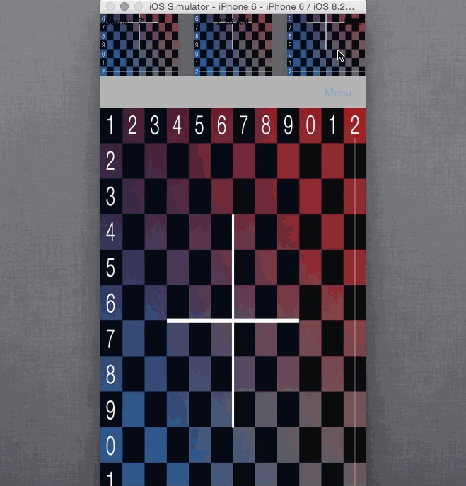

# topDrawer
Swift: Top Drawer with Storyboards

This is a simple project which uses two container views. One for top drawer and one for main container. 
Supports autolayout. 
The project is very simple and straight forward. 

Just place your own viewcontrollers with the existing ones and set :  
var topMenuHeight : CGFloat = 150 
for desired drawer height.

